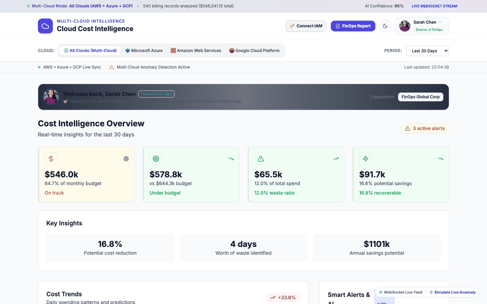

# AI-Powered Cloud Cost Intelligence Platform

> **Live Multi-Cloud Production Dashboard:** [https://ai-cloud-cost-intelligence-dashboard-git-main-sean-912c.vercel.app](https://ai-cloud-cost-intelligence-dashboard-git-main-sean-912c.vercel.app)  
> **Master Architectural Guide (17 Pages):** [AI_Cloud_Cost_Intelligence_Platform_Master_Guide.pdf](./AI_Cloud_Cost_Intelligence_Platform_Master_Guide.pdf)  
> **Master Markdown Documentation:** [PLATFORM_MASTER_DOCUMENTATION.md](./PLATFORM_MASTER_DOCUMENTATION.md)  

---

## 🎬 Multi-Cloud Live Demo Walkthrough



*Demonstrating multi-cloud telemetry switching across **AWS**, **Microsoft Azure**, and **Google Cloud Platform (GCP)**, real-time WebSocket anomaly detection, and 1-click transactional AI remediation.*

---

## What this project does

The platform unifies **$546K/month in multi-cloud infrastructure spend** across AWS, Azure, and GCP, combining a Next.js 14 dashboard, Express/TypeScript API, Model Context Protocol (MCP) tool servers, and Claude 3.5 Sonnet AI reasoning.

### Core capabilities

- **Cloud cost dashboard** — spending trends, department breakdowns, alerts, and optimization opportunities.
- **AI Cost Assistant** — ask natural-language questions about cloud spend and receive answers grounded in the supplied cost data.
- **AI analysis engine** — reusable analysis flows for cost analysis, anomaly detection, optimization, forecasting, and interactive queries.
- **Azure Cost MCP server** — provides a clean tool interface for Azure cost data; it can use the included deterministic demo dataset when Azure credentials are not configured.
- **Real-time infrastructure** — WebSocket support and background jobs are retained for deployments that enable the database/cache pipeline.
- **Local-first development** — the dashboard and AI chat can run without PostgreSQL or Redis by using the built-in demo data path.

## Architecture

```text
Next.js Dashboard (:3000)
        |
        | HTTP / WebSocket
        v
Express Backend (:8000)
   |        |        |
   |        |        +--> Azure Cost MCP
   |        |
   |        +-----------> AI Analysis Engine
   |                         |
   |                         +--> Anthropic Claude
   |
   +--> PostgreSQL / Redis (optional production pipeline)
```

### Main directories

- `dashboard/` — Next.js frontend.
- `backend/` — Express API, orchestration, WebSocket support, and services.
- `ai-analysis-engine/` — Claude-powered analysis library.
- `mcp-servers/azure-cost-mcp/` — Azure cost MCP server and demo data provider.
- `mock-data/` — development/demo data utilities.
- `docs/` — Azure setup notes.
- `research/` — supporting research used by the project.

## AI chat

The chat flow is intentionally backend-only:

1. The browser sends the user's question to `POST /api/ai/analyze`.
2. The backend attaches the current demo/Azure cost data.
3. The AI engine sends the request to Claude.
4. Claude returns structured JSON containing an answer, insights, metrics, comparisons, and recommendations.
5. The backend normalizes that result and returns a stable response to the dashboard.

The Anthropic API key is **never sent to the browser**.

The default model is `claude-haiku-4-5`, configurable through `ANTHROPIC_MODEL`.

## Important security note

Never commit an Anthropic API key. The original project archive contained a live-looking key in both `.env` and `.env.example`; those files have been sanitized in this cleaned project.

If that key is real, **rotate/revoke it in the Anthropic console** and create a replacement. Then put the replacement only in your local `.env`.

## Requirements

- Node.js 18+ (Node.js 20+ recommended)
- npm 9+
- An Anthropic API key for live AI responses
- Docker is optional; PostgreSQL and Redis are only needed for the full persistence/cache pipeline

## Quick start

```bash
# 1. Install dependencies
npm install

# 2. Configure environment
cp .env.example .env
# Edit .env and set ANTHROPIC_API_KEY

# 3. Start frontend + backend
npm run dev:full
```

Open:

- Frontend: http://localhost:3000
- Backend health: http://localhost:8000/health

### Run services separately

```bash
npm run dev:backend
npm run dev
```

### Build

```bash
npm run build
```

If the Next.js build asks to download a platform-specific SWC binary, make sure the machine running `npm install` has network access and run `npm install` again.

## Environment

The important variables are:

```dotenv
ANTHROPIC_API_KEY=
ANTHROPIC_MODEL=claude-haiku-4-5

PORT=8000
FRONTEND_URL=http://localhost:3000
NEXT_PUBLIC_API_URL=http://localhost:8000

SKIP_DATABASE=false
SKIP_REDIS=false
```

The included `docker-compose.yml` starts PostgreSQL and Redis. For the full local stack, run `docker compose up -d` and use `SKIP_DATABASE=false` and `SKIP_REDIS=false`. If you intentionally want the lightweight no-Docker demo, set both flags to `true`.

For a production-style deployment, configure PostgreSQL, Redis, and the Azure credentials documented in `docs/azure-setup.md`.

## API endpoints

### Health

`GET /health`

Returns the status of the backend, AI service, MCP integration, database, and cache.

### Cost data

`GET /api/azure/costs`

Returns the current deterministic demo cost dataset when Azure billing credentials are not configured.

### AI chat

`POST /api/ai/analyze`

Example body:

```json
{
  "query": "Which department is spending the most and what should I optimize first?"
}
```

### Full dashboard analysis

`GET /api/full-analysis`

Returns cost data plus an AI-generated overview used by the dashboard.

## Data and AI behavior

Demo data is deterministic rather than randomly regenerated on every request. This makes the UI easier to test and prevents the dashboard from appearing to change for no reason.

AI-generated numeric claims are instructed to use only the supplied cost data. If the data is insufficient, the assistant is instructed to say so rather than inventing a result.

If the Anthropic service is unavailable, the frontend shows a clear service error instead of displaying fabricated “simulated AI” answers.

## Optional Docker services

```bash
docker compose up -d
```

This starts PostgreSQL and Redis. Configure:

```dotenv
SKIP_DATABASE=false
SKIP_REDIS=false
```

before using the persistence/data-pipeline features.

## Development dependency: AI engine build

The backend imports the `ai-analysis-engine` workspace by package name. The workspace intentionally does not commit its generated `dist/` directory. When you run `npm run dev:backend`, the backend `predev` hook automatically builds the AI engine first, so a fresh checkout does not fail with `ERR_MODULE_NOT_FOUND` for `ai-analysis-engine`.

If you ever see that error after changing dependencies, run:

```bash
npm install
npm run build:ai
npm run dev:full
```

Do not manually copy the AI engine into `backend/node_modules`; npm workspaces manage that link.

## Troubleshooting

### AI chat says it cannot reach the AI service

Check:

```bash
curl http://localhost:8000/health
```

Then verify that `.env` contains a valid `ANTHROPIC_API_KEY` and that the backend was restarted after changing it.

### Frontend cannot connect to backend

Confirm:

```dotenv
NEXT_PUBLIC_API_URL=http://localhost:8000
```

and that the backend is listening on port 8000.

### Port already in use

Change `PORT` in `.env`, then update `NEXT_PUBLIC_API_URL` if the frontend is calling a different backend port.

### Database/Redis errors

For a simple local run, keep:

```dotenv
SKIP_DATABASE=true
SKIP_REDIS=true
```

The dashboard and AI assistant are designed to work in this mode.

## Cleanup policy

Generated/runtime artifacts are intentionally excluded from the source archive:

- `node_modules/`
- `.next/`
- build `dist/` directories
- `.git/`
- macOS `.DS_Store` and `__MACOSX/`
- temporary archives

Install dependencies and regenerate builds locally with `npm install` and `npm run build`.

## Project status

This repository is structured as a development/demo platform with an upgrade path to live Azure Cost Management data. The default path is deliberately easy to run locally, while the MCP, database, Redis, WebSocket, and scheduled-pipeline components remain available for a fuller deployment.
